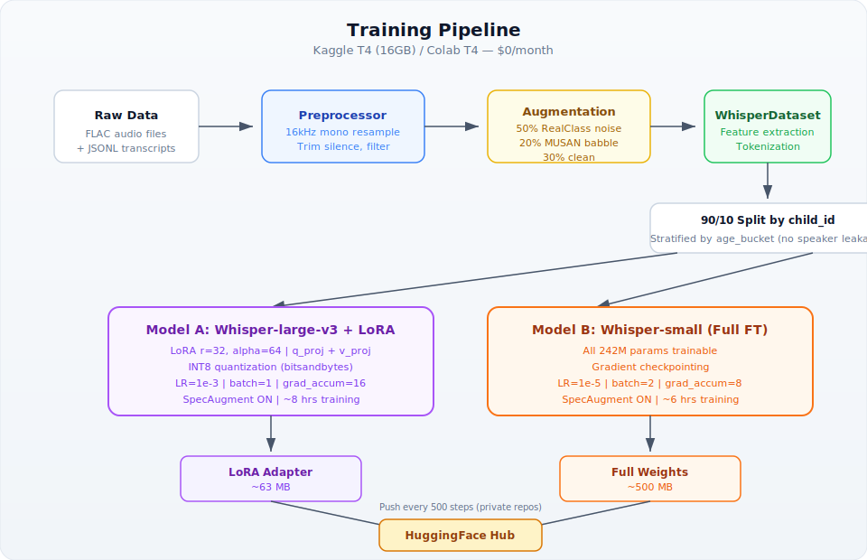
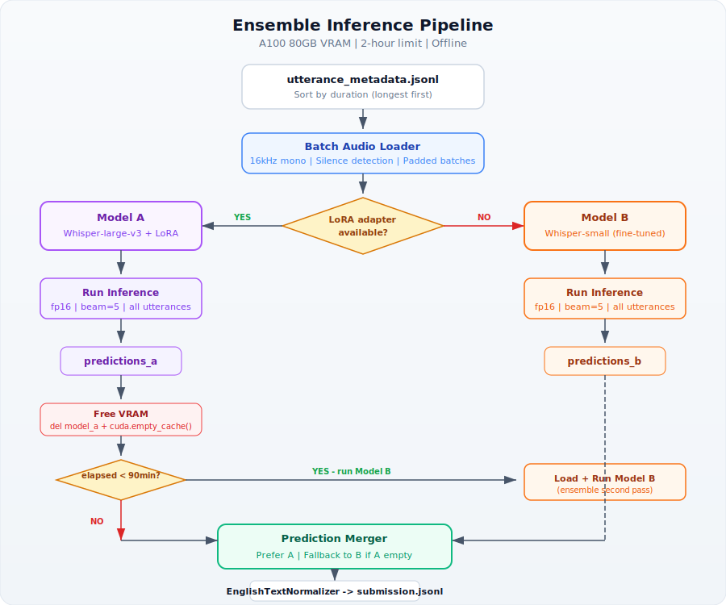

# ChildWhisper

**Two-model ensemble for children's speech transcription** — [DrivenData Pasketti Challenge (Word Track)](https://www.drivendata.org/competitions/308/childrens-word-asr/)

Whisper-large-v3 (LoRA) + Whisper-small (full fine-tune) trained on competition data with classroom noise augmentation. Deployed on A100 inference runtime. Target WER: <0.20.

## Architecture

See [architecture.md](architecture.md) for full system design with diagrams.




## Quick Start

```bash
# Install dependencies
pip install -r requirements.txt

# Run tests
pytest tests/ -v

# Local inference test (CPU/MPS)
python submission/main.py
```

## Project Structure

```
childwhisper/
├── src/                          # Core source code
│   ├── preprocess.py             # Audio loading, resampling, silence detection
│   ├── augment.py                # Noise augmentation (RealClass + MUSAN)
│   ├── dataset.py                # PyTorch Dataset + DataCollator for Whisper
│   ├── train_whisper_small.py    # Full fine-tune script
│   ├── train_whisper_lora.py     # LoRA fine-tune script
│   ├── evaluate.py               # WER computation, child_id split, per-age breakdown
│   └── utils.py                  # Text normalization (EnglishTextNormalizer)
├── submission/                   # Competition submission package
│   ├── main.py                   # Ensemble inference entrypoint (A100)
│   └── model_weights/            # Downloaded from HF Hub
├── notebooks/                    # Kaggle/Colab training notebooks
│   ├── 01_eda.ipynb
│   ├── 02_train_small.ipynb
│   ├── 03_train_lora.ipynb
│   └── 04_augmented.ipynb
├── tests/                        # pytest test suite (252 tests)
├── configs/
│   └── training_config.yaml      # Hyperparameters for both models
├── specs/                        # Spec-driven development artifacts
├── scripts/                      # Shell scripts (download, build)
└── data/                         # .gitignored — local audio samples
```

## Models

| Model | Type | Params | Training | Checkpoint Size |
|-------|------|--------|----------|----------------|
| Whisper-large-v3 + LoRA | Primary | ~15M trainable (1.55B base) | LoRA r=32, alpha=64, INT8, Kaggle T4 | ~63 MB adapter |
| Whisper-small | Secondary | 242M (full) | Full fine-tune, gradient checkpointing | ~500 MB |

## Ensemble Inference

```
1. Load Model A (Whisper-large-v3 + LoRA adapter) in fp16
2. Run inference on all utterances (sorted by duration, beam=5)
3. If time budget allows (<90 min elapsed):
   a. Free Model A VRAM
   b. Load Model B (Whisper-small fine-tuned)
   c. Run inference on all utterances
4. Merge: prefer Model A, fall back to Model B on empty predictions
5. Apply EnglishTextNormalizer to all output
6. Write submission.jsonl
```

**Time budget**: 2 hours on A100 80GB (offline, no network).

## Training

All training runs on **free GPU tiers** (Kaggle T4x2 30hrs/wk + Colab T4):

```bash
# Whisper-small full fine-tune
python src/train_whisper_small.py \
  --metadata-path data/train_word_transcripts.jsonl \
  --audio-dir data/audio/ \
  --dry-run  # test locally first

# Whisper-large-v3 LoRA
python src/train_whisper_lora.py \
  --metadata-path data/train_word_transcripts.jsonl \
  --audio-dir data/audio/ \
  --dry-run

# Use a data subset for faster iteration (override config)
python src/train_whisper_small.py \
  --metadata-path data/train_word_transcripts.jsonl \
  --audio-dir data/audio/ \
  --subset-fraction 0.3
```

### Training Time Optimization

The full dataset (228k utterances) takes ~67 hours on T4x2. To fit within a single Kaggle session, the following optimizations are applied by default:

| Optimization | Effect |
|-------------|--------|
| **30% stratified data subset** | Trains on ~68k samples (stratified by age_bucket, grouped by child_id — no leakage) |
| **Larger batch sizes** | Whisper-small: 8/GPU (was 2), LoRA: 2/GPU (was 1) |
| **Lower gradient accumulation** | Whisper-small: 4 (was 8), LoRA: 8 (was 16) |
| **More dataloader workers** | 4 (was 2) |

Set `data_subset.fraction: 1.0` in `configs/training_config.yaml` to use the full dataset.

## Validation

- 90/10 split by `child_id` (no speaker leakage)
- Stratified by `age_bucket` (3-4, 5-7, 8-11, 12+)
- Per-age-bucket WER tracking
- Synthetic noisy validation (RealClass noise at SNR 10 dB)

## Development Approach

Spec-driven TDD with 5 phases:

| Phase | Status | Description |
|-------|--------|-------------|
| 1. Project Setup & Baseline | Done | Zero-shot submission, local validation |
| 2. Whisper-small Fine-Tune | Done | Full fine-tune, WER ~0.15-0.20 |
| 3. Whisper-large-v3 LoRA | Done | LoRA adapter, ensemble inference |
| 4. Noise Augmentation | Done | Classroom noise robustness |
| 5. Optimizations & Polish | Done | Training time optimization, data subsetting |

## Tech Stack

| Component | Technology | Cost |
|-----------|-----------|------|
| ASR Framework | HuggingFace Transformers + PEFT | Free |
| Quantization | bitsandbytes (INT8) | Free |
| Audio | librosa + soundfile + torchaudio | Free |
| Augmentation | audiomentations | Free |
| Evaluation | jiwer (WER) | Free |
| GPU Training | Kaggle T4 (30 hrs/wk) + Colab T4 | $0 |
| Model Storage | HuggingFace Hub (private) | $0 |
| **Total monthly** | | **$0-10** |

## Tests

```bash
pytest tests/ -v          # 252 tests
ruff check src/ submission/ tests/  # lint
```

## License

Competition code — not for redistribution. See DrivenData competition rules.
