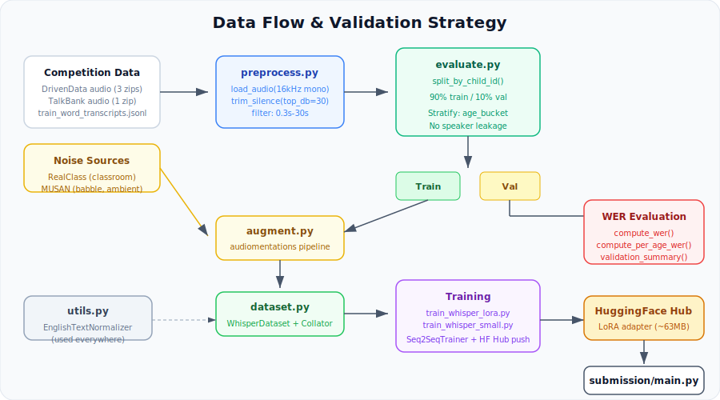

# Architecture — ChildWhisper

Two-model ensemble for children's speech transcription on the [Pasketti Challenge (Word Track)](https://www.drivendata.org/competitions/308/childrens-word-asr/).

## System Overview

ChildWhisper runs two Whisper models sequentially on an A100 GPU, merging their predictions to minimize Word Error Rate on children's speech.

| Component | Model | Params | Role |
|-----------|-------|--------|------|
| **Model A** | Whisper-large-v3 + LoRA | 1.55B (15M trainable) | Primary — best accuracy |
| **Model B** | Whisper-small (full FT) | 242M | Fallback — fewer hallucinations on short clips |

## Training Pipeline


### Flow

```
Raw FLAC + JSONL
    -> Preprocessor (16kHz mono, trim silence, duration filter)
    -> Augmentation (50% RealClass noise, 20% MUSAN babble, 30% clean)
    -> WhisperDataset (feature extraction, tokenization, padding)
    -> 90/10 child_id split (stratified by age_bucket, no speaker leakage)
    -> Training (Kaggle T4 / Colab T4)
        -> Model A: LoRA r=32, alpha=64, INT8 quant, LR=1e-3
        -> Model B: Full FT, gradient checkpointing, LR=1e-5
    -> Checkpoints pushed to HuggingFace Hub every 500 steps
```

### Key Design Decisions

| Decision | Rationale |
|----------|-----------|
| LoRA instead of full FT for large-v3 | 1.55B params won't fit on T4; LoRA+INT8 uses ~8GB |
| INT8 quantization | Fits training on T4 (16GB); negligible accuracy loss |
| SpecAugment ON | Whisper ships with it disabled; free regularization for ~1-2% WER improvement |
| child_id split | Prevents speaker leakage — same child never in both train and val |
| age_bucket stratification | Ensures representation of all age groups (3-4, 5-7, 8-11, 12+) |

### Training Configuration

```yaml
# Model A: Whisper-large-v3 + LoRA
model_name: openai/whisper-large-v3
load_in_8bit: true
lora: {r: 32, alpha: 64, target: [q_proj, v_proj], dropout: 0.05}
lr: 1e-3
batch: 1, grad_accum: 16
training_time: ~8 hours on T4

# Model B: Whisper-small (full fine-tune)
model_name: openai/whisper-small
lr: 1e-5
batch: 2, grad_accum: 8
gradient_checkpointing: true
training_time: ~6 hours on T4
```

## Inference Pipeline


### Flow

```
1. Load utterance_metadata.jsonl
2. Sort utterances by duration (longest first → minimize padding waste)
3. TRY load Model A (Whisper-large-v3 + LoRA adapter)
   -> Run inference: fp16, beam=5, batch=16
   -> Store predictions_a
   -> Free VRAM (del model + cuda.empty_cache)
4. IF elapsed < 90 minutes:
   -> Load Model B (Whisper-small fine-tuned)
   -> Run inference: fp16, beam=5, batch=16
   -> Store predictions_b
5. MERGE predictions:
   -> For each utterance: use predictions_a UNLESS empty → then use predictions_b
6. Apply EnglishTextNormalizer to all predictions
7. Write submission.jsonl
```

### Time Budget

| Phase | Estimated Time | Cumulative |
|-------|---------------|------------|
| Load metadata + sort | ~1s | 1s |
| Load Model A (3.1GB) | ~30s | 31s |
| Model A inference | ~30-50 min | ~50 min |
| Free VRAM + Load Model B | ~15s | ~50 min |
| Model B inference | ~15-25 min | ~75 min |
| Merge + normalize + write | ~5s | ~75 min |
| **Safety margin** | **45 min** | **120 min** |

### Graceful Degradation

```
Adapter found?  ──YES──> Run Model A + Model B (ensemble)
                │
                NO
                │
                └──> Run Model B only (single model, still competitive)
```

If Model A's LoRA adapter is missing (FileNotFoundError), the pipeline automatically falls back to Model B (Whisper-small) only. No crash, no empty submission.

## Data Flow



### Module Responsibilities

| Module | File | Purpose |
|--------|------|---------|
| **Preprocessor** | `src/preprocess.py` | Load audio (16kHz mono), trim silence, duration filter, silence detection |
| **Normalizer** | `src/utils.py` | Whisper EnglishTextNormalizer wrapper (lowercase, expand contractions, remove punctuation) |
| **Augmentation** | `src/augment.py` | RealClass + MUSAN noise mixing via audiomentations |
| **Dataset** | `src/dataset.py` | PyTorch Dataset with feature extraction, tokenization, padding, collation |
| **Training (small)** | `src/train_whisper_small.py` | Full fine-tune with Seq2SeqTrainer |
| **Training (LoRA)** | `src/train_whisper_lora.py` | LoRA + INT8 fine-tune with Seq2SeqTrainer |
| **Evaluation** | `src/evaluate.py` | WER computation, child_id split, per-age breakdown |
| **Inference** | `submission/main.py` | Ensemble inference pipeline (Model A + B, merge, time budget) |

## Infrastructure

```
┌─────────────────────────────────────────────────────────┐
│                    Development (MacBook)                  │
│  Code editing, tests (252 pytest), linting (ruff)        │
│  Local inference testing on CPU/MPS with audio samples   │
└────────────────────────┬────────────────────────────────┘
                         │ git push
                         ▼
┌─────────────────────────────────────────────────────────┐
│                    Training (Kaggle T4)                   │
│  30 hrs/wk free | Upload audio as Kaggle dataset         │
│  Checkpoints -> HuggingFace Hub (private)                │
└────────────────────────┬────────────────────────────────┘
                         │ download weights
                         ▼
┌─────────────────────────────────────────────────────────┐
│                 Inference (A100 80GB)                     │
│  Offline | 2hr limit | submission.zip with bundled weights│
│  Sequential ensemble: large-v3 + LoRA -> small -> merge  │
└─────────────────────────────────────────────────────────┘
```

## Validation Strategy

- **Split**: 90/10 by `child_id` (no child in both train and val)
- **Stratification**: by `age_bucket` for proportional representation
- **Metrics**: Overall WER, per-age-bucket WER, empty prediction count
- **Noisy validation**: Val audio + RealClass noise at SNR 10 dB
- **Hallucination detection**: Flag predictions where word count > 3x reference

## Key Constraints

| Constraint | Value |
|-----------|-------|
| Inference GPU | A100 80GB |
| Wall time | 2 hours |
| Network | None (offline) |
| Budget | $0-10/month |
| Training GPU | Kaggle T4 16GB (free) |
| Submission format | JSONL with utterance_id + orthographic_text |
